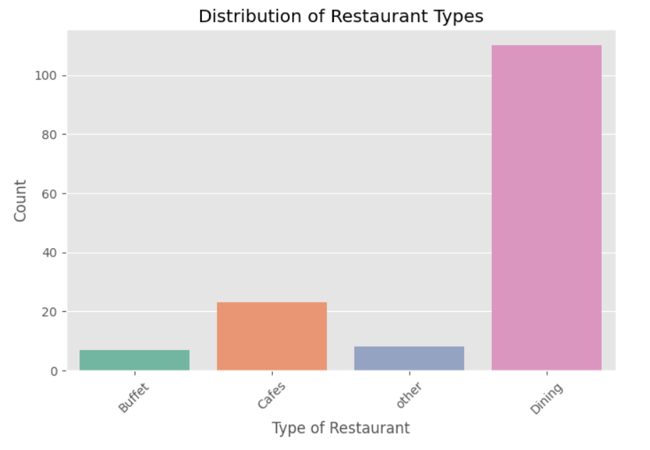
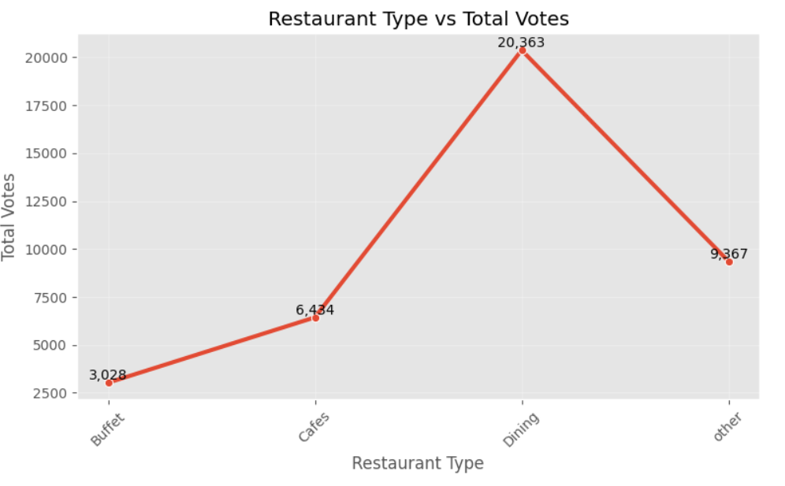
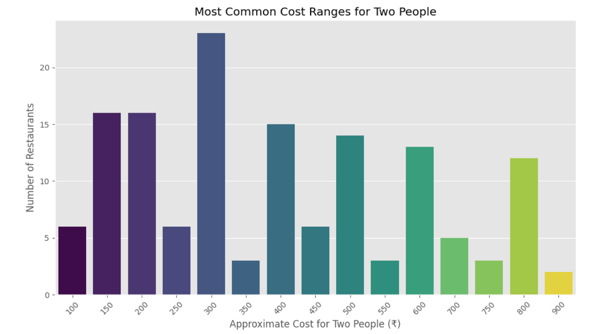
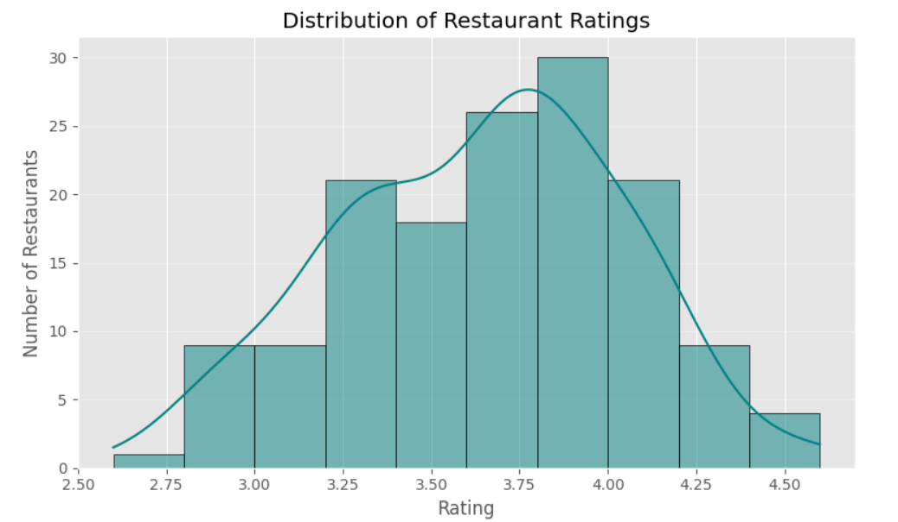

# 🍽️ Zomato Restaurant Analysis

## Overview
This project explores Zomato restaurant data to understand customer preferences, restaurant popularity, ratings, and online ordering trends using Python.

## Tools  & Technologies
- Python
- Pandas
- NumPy
- Seaborn
- Matplotlib
- Jupyter Notebook

## Key Insights
- ####Dining restaurants receive the highest customer engagement.

  

  
- ####Dining Restaurants are more preferred by people.

   

  
- ####Majority of couples prefer approx 300rs.

   

  
- ####Most ratings fall between 3.5 and 4.5.

   

  and much more....

## 📈 Business Recommendations

- Restaurants should consider enabling online ordering.
- Focus on customer experience to maintain ratings above 4.0.
- Invest more in popular restaurant categories.
- Use customer feedback to improve engagement.

## Future Improvements
- Interactive Streamlit Dashboard
- Predictive Rating Analysis
- Review Sentiment Analysis

## Author
Rishita Baranwal
